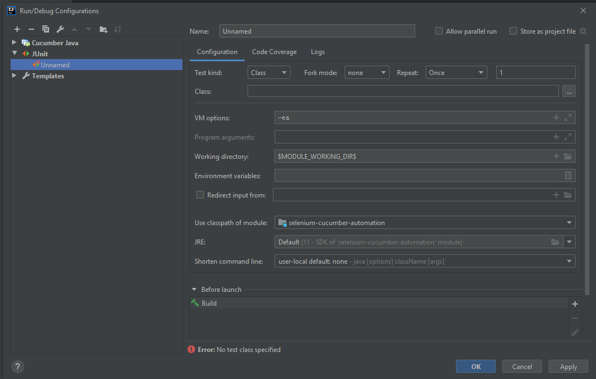
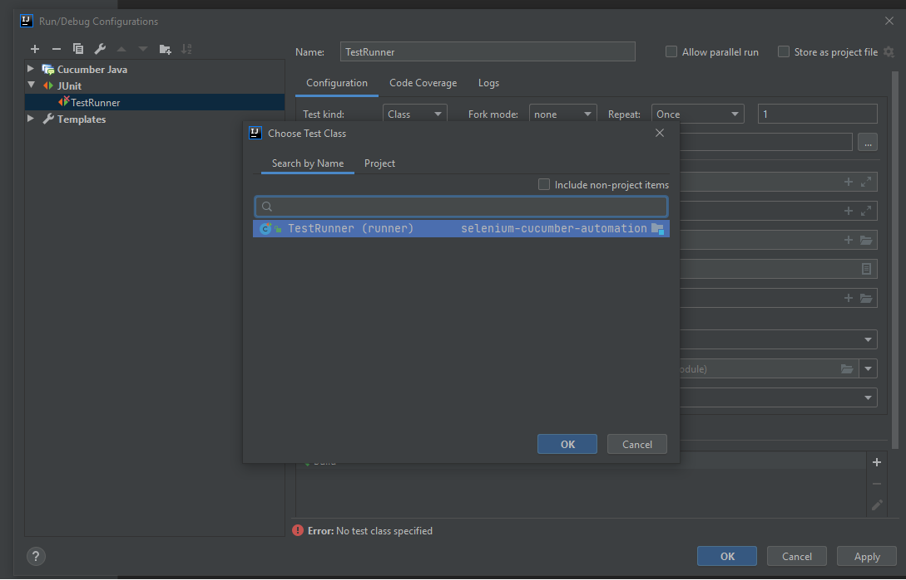
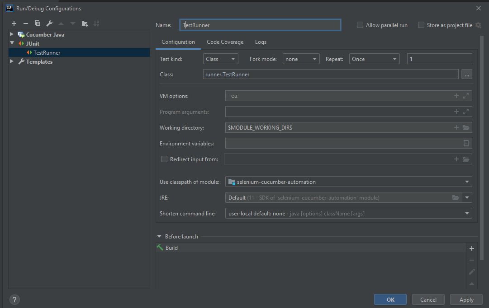

# Test automation using Selenium Webdriver and Cucumber
Testing tool structure using cucumber and selenium.

## Prerequisites
 - Have installed IntelliJ IDE

 - The minimum Java version must be 11

 - Cucumber version 4.3.2 or higher

 - The minimum Selenium version 3.14.0
 
## Usage

First, download the project and open it with IntelliJ

In IntelliJ, click on “Add Configuration” select "+" and create a file of type "JUnit"

Rename the file to TestRunner.

And click to select the test class TestRunner.class will run all tests.

Your configuration should look like the image below

After these steps just run the tests in the IDE or press SHIFT + F10
